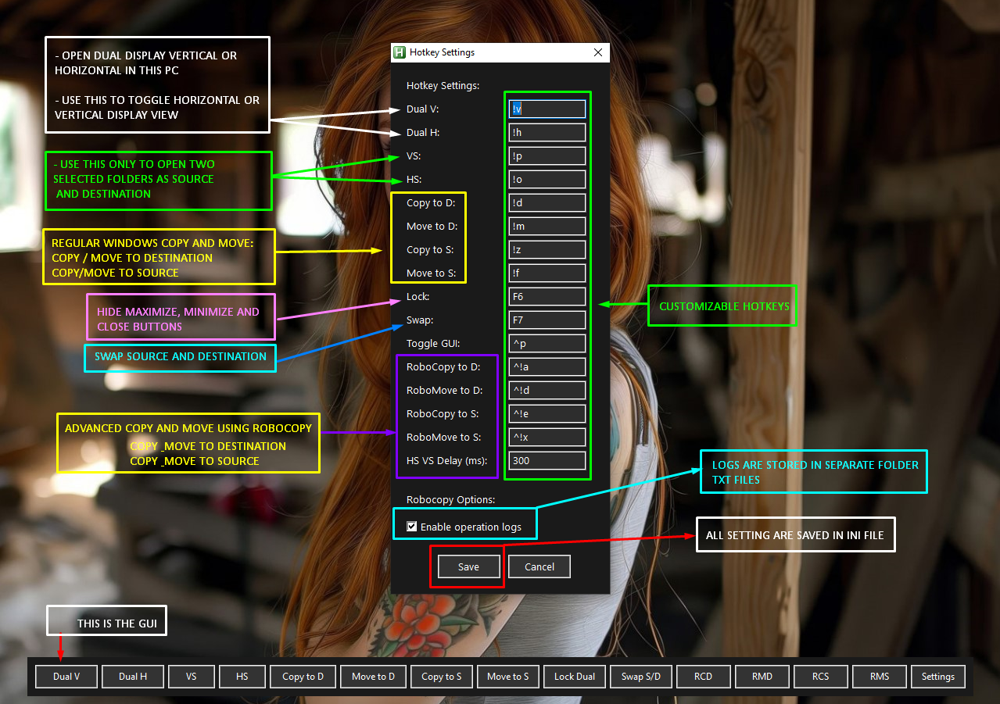
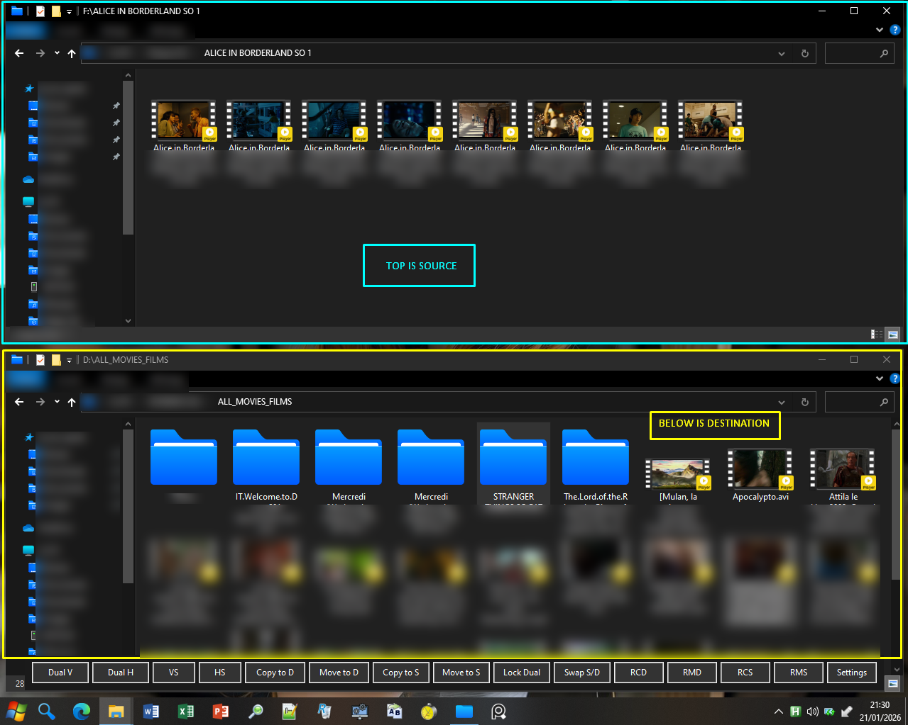
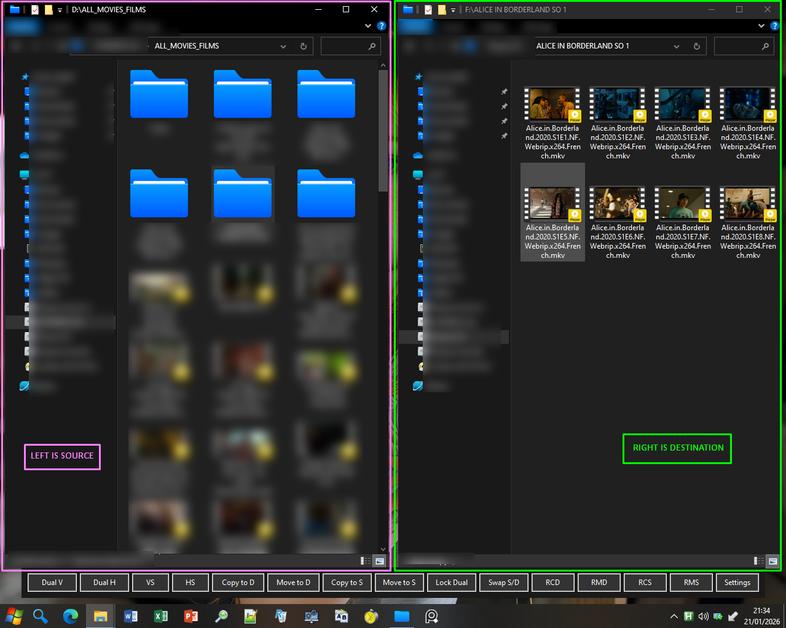
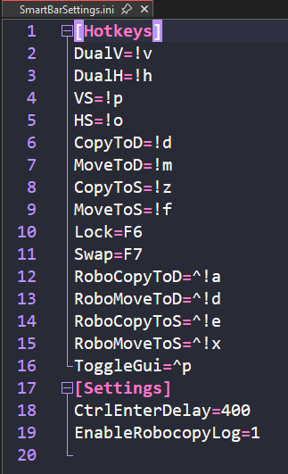
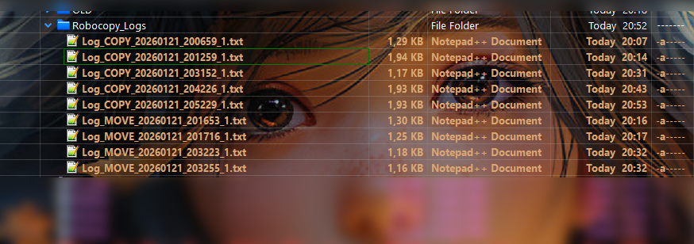
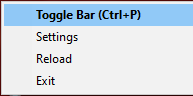

# 🚀 Explorer Dual Display Manager - Definitive Edition

> **Transform your Windows Explorer workflow with advanced dual-pane management, intelligent window tracking, and enterprise-grade file operations powered by Robocopy**

---

## 📋 Table of Contents
- [Overview](#-overview)
- [Key Features](#-key-features)
- [Installation](#-installation)
- [Core Features Explained](#-core-features-explained)
- [Advanced Operations](#-advanced-operations)
- [Customization](#-customization)
- [Tips & Tricks](#-tips--tricks)

---

## 🎯 Overview

**Explorer Dual Display Manager** is a comprehensive AutoHotkey script that supercharges Windows File Explorer with professional-grade dual-pane functionality, intelligent window management, and robust file operations. Whether you're managing massive file transfers, organizing your workspace, or need precise control over multiple Explorer windows, this tool delivers.

---

## ✨ Key Features

### 🖥️ **Dual Display Modes**
- **Vertical Split** (`Alt+V`) - Side-by-side panes perfect for drag-and-drop workflows
- **Horizontal Split** (`Alt+H`) - Top-bottom layout ideal for comparing folder contents
- **Instant repositioning** with automatic window sizing
- **Lock Mode** (F6) - Prevents accidental window closure or minimization
- **Smart Swap** (F7) - Physically swap source and destination positions

### 📁 **Selection-Based Opening (VS/HS)**
- **VS** (`Alt+P`) - Opens selected folders in **Vertical Split**
- **HS** (`Alt+O`) - Opens selected folders in **Horizontal Split**
- Select 1 folder: Opens that folder + current location
- Select 2+ folders: Opens first two as Source/Destination
- **Intelligent History Tracking** - Remembers your last 20 closed folders
- **Customizable Delay** - Fine-tune timing for Ctrl+Enter detection (default: 300ms)

> 💡 **Why the delay matters**: When you select folders and trigger VS/HS, the script sends `Ctrl+Enter` to open them in new windows. The delay allows Windows Explorer to fully process this command before the script captures and positions the windows. If windows aren't positioning correctly, increase this value in Settings!

---

## 🔄 Core Features Explained

### 📂 **Quick Copy/Move Operations**
Fast keyboard-driven file transfers between Source (S) and Destination (D):

| Function | Hotkey | Description |
|----------|--------|-------------|
| **Copy to Destination** | `Alt+D` | Copy from active window to Destination |
| **Move to Destination** | `Alt+M` | Move from active window to Destination |
| **Copy to Source** | `Alt+Z` | Copy from active window to Source |
| **Move to Source** | `Alt+F` | Move from active window to Source |

> These use standard Windows copy/paste (`Ctrl+C`/`Ctrl+V`) - perfect for quick operations!

---

### 🛡️ **Robocopy Integration - Why It's Superior**

Traditional Windows copy operations have critical limitations:

❌ **Standard Copy Problems:**
- No resume capability on network interruptions
- Limited error handling
- No verification of copied files
- Single-threaded (slow for large transfers)
- Minimal logging
- Can't handle long paths (>260 characters)

✅ **Robocopy Advantages:**
- **Multi-threaded transfers** (`/MT:8`) - Up to 8x faster!
- **Automatic retry** (`/R:3 /W:5`) - 3 retries with 5-second waits
- **Handles network interruptions** - Resumes where it left off
- **Recursive directory copying** (`/E`) - Perfect for folder structures
- **Move mode** (`/MOVE` or `/MOV`) - Atomic move operations
- **Detailed logging** with timestamps and statistics
- **Long path support** - Handles paths >260 characters
- **Progress visibility** - See real-time transfer status

### 🚀 **Robocopy Operations**

| Function | Hotkey | Mode | Description |
|----------|--------|------|-------------|
| **RoboCopy to D** | `Ctrl+Alt+A` | Copy | Robust copy with verification |
| **RoboMove to D** | `Ctrl+Alt+D` | Move | Move + delete source safely |
| **RoboCopy to S** | `Ctrl+Alt+E` | Copy | Copy to Source pane |
| **RoboMove to S** | `Ctrl+Alt+X` | Move | Move to Source pane |

#### 📊 **Robocopy Features:**
- **Live Progress Window** - See exactly what's happening
- **Automatic Logging** - Every operation saved to timestamped log files
- **Smart Selection Detection** - Works with both COM API and clipboard fallback
- **Confirmation Dialog** - Shows exactly what will be transferred
- **Exit Code Validation** - Only marks success on valid completion (codes 0-7)
- **Auto-refresh** - Both Explorer windows refresh after completion

#### 📝 **Log Management**
- Logs stored in `Robocopy_Logs` folder (script directory)
- Format: `Log_COPY_20260122_143055_1.txt`
- Contains: Transfer stats, errors, timestamps, file lists
- Option to open logs folder after operation
- Enable/disable logging in Settings

---

## 🎨 **Window Management**

### 📍 **Numpad Positioning** (`Alt+Numpad`)
Instantly position any active window:

```
7️⃣ Top-Left      8️⃣ Top-Center     9️⃣ Top-Right
4️⃣ Middle-Left   5️⃣ Center         6️⃣ Middle-Right
1️⃣ Bottom-Left   2️⃣ Bottom-Center  3️⃣ Bottom-Right
```

### 📚 **Minimize Stack (Built-in)**
- Intelligent window stacking when opening dual displays
- Automatically minimizes old dual windows
- Restores them when reopening (preserves paths!)
- LIFO (Last-In-First-Out) stack behavior

### 🔒 **Lock Dual Mode** (F6)
Prevents accidental disruption:
- Disables Close button (❌)
- Disables Minimize button (➖)
- Disables Maximize button (🔲)
- `Alt+F4` still works for intentional closure
- Perfect for important file operations

---

## 🎛️ **Customization**

### ⚙️ **Settings Panel** (`Ctrl+P` or Settings button)

<details>
<summary>📌 Customizable Hotkeys</summary>

Every hotkey is fully customizable:
- Dual V / Dual H
- VS / HS (Selection modes)
- Copy/Move to D/S
- Lock / Swap
- Robocopy operations
- Toggle GUI visibility

</details>

<details>
<summary>⏱️ HS/VS Delay Configuration</summary>

**What it does**: Controls timing between `Ctrl+Enter` and window capture

**When to adjust**:
- 🔽 **Lower (150-250ms)**: Fast SSD, few Explorer extensions
- 🔼 **Higher (400-600ms)**: Slow HDD, many shell extensions, older PC
- ⚖️ **Default (300ms)**: Balanced for most systems

**Symptoms of incorrect timing**:
- Windows open but don't position correctly → Increase delay
- Feels sluggish → Decrease delay

</details>

<details>
<summary>📋 Robocopy Options</summary>

- **Enable operation logs**: Toggle logging on/off
- Logs saved with timestamps for audit trails
- Helpful for troubleshooting failed transfers

</details>

### 💾 **Settings Persistence**
All settings saved to `SmartBarSettings.ini`:
- Hotkey assignments
- Delay timings
- Robocopy preferences
- Automatically loaded on startup

---

## 🖱️ **Smart GUI Bar**

A sleek, dark-themed control bar sits above your taskbar:

| Button | Function |
|--------|----------|
| **Dual V** | Open vertical dual display |
| **Dual H** | Open horizontal dual display |
| **VS** | Vertical split from selection |
| **HS** | Horizontal split from selection |
| **Copy to D** | Copy to Destination |
| **Move to D** | Move to Destination |
| **Copy to S** | Copy to Source |
| **Move to S** | Move to Source |
| **Lock Dual** | Toggle window locking |
| **Swap S/D** | Swap source/destination positions |
| **RCD** | RoboCopy to Destination |
| **RMD** | RoboMove to Destination |
| **RCS** | RoboCopy to Source |
| **RMS** | RoboMove to Source |
| **Settings** | Open configuration |

**Toggle GUI**: Press `Ctrl+P` to show/hide the bar!

---

## 💡 Tips & Tricks

### 🎯 **Workflow Examples**

**📦 Organizing Downloads:**
1. Select your Downloads folder + target folder
2. Press `Alt+P` (VS)
3. Drag files from left to right
4. Press `F6` to lock if doing bulk operations

**🔄 Syncing Folders:**
1. Open dual display to source/destination
2. Select files/folders to sync
3. Press `Ctrl+Alt+A` (RoboCopy to D)
4. Review confirmation and proceed
5. Check logs for verification

**📂 Multi-folder Navigation:**
1. Select multiple folders (Ctrl+Click)
2. Press `Alt+O` (HS)
3. Opens first two in horizontal split
4. Easily compare folder contents

### ⚡ **Performance Tips**
- Use Robocopy for transfers >100MB or >100 files
- Enable logging for critical operations
- Use Lock mode during large transfers to prevent accidents
- Increase VS/HS delay if using antivirus that scans files on open

### 🔧 **Troubleshooting**

**Windows not positioning?**
- Increase HS/VS Delay in Settings
- Check if other Explorer extensions conflict
- Ensure AutoHotkey v1.1+ is installed

**Robocopy not working?**
- Verify source/destination paths are valid
- Check Windows permissions
- Review log files for detailed errors

**Hotkeys not working?**
- Check for conflicts with other software
- Verify hotkeys in Settings
- Restart script after changing hotkeys

---

## 📥 Installation

1. **Install AutoHotkey v1.1+** from [autohotkey.com](https://www.autohotkey.com/)
2. **Download** `Explorer_Dual_Display_Manager_Definitive_Edition.ahk`
3. **Double-click** the script to run
4. **Optional**: Create a shortcut in your Startup folder for auto-launch

---

## 🛠️ Technical Details

- **Language**: AutoHotkey v1.1
- **Dependencies**: Windows COM (Shell.Application)
- **Compatibility**: Windows 7/8/10/11
- **File Operations**: Windows Explorer + Robocopy.exe
- **Settings Storage**: INI file format
- **Window Tracking**: 2-second polling timer

---

## 📜 License

This script is provided as-is for personal and commercial use. Feel free to modify and distribute!

---

## 🙏 Credits

Created with ❤️ for power users who demand more from Windows Explorer

---

### 🌟 Star this repo if it boosts your productivity! 🌟

___


📽️ Watch Demo Here (The recording is slow)


___


📜 Overview of all features





___


📌 Top Folder is the Source and Below Folder is the Destination in Dual Display Horizontal





___


🌱 Left Folder is the Source and Right Folder is the Destination in Dual Display Vertical





___


📜 Setting: INI File





___


📗 Robocopy Operation Logs





___


###  📌 EXPLORER DUAL DISPLAY MANAGER PRO

___


##  💎New Tray Menu added




---


## 📌What's New — v26.05.20 (Pro Edition)


### ✅System Tray Menu


The script now registers a custom tray icon menu, replacing the default AutoHotkey one. Right-clicking the tray icon gives you quick access to:


- **Toggle Bar** (`Ctrl+P`) — show or hide the floating toolbar

- **Settings** — open the hotkey/options panel

- **Reload** — restart the script on the fly

- **Exit** — cleanly close the application


The default tray action (double-click) is also bound to **Toggle Bar** for faster access.


### ✅Robocopy Log — Fixed & Improved


The log system has been corrected and is now fully reliable:


- Each Robocopy operation generates a timestamped `.txt` log file saved in a dedicated `Robocopy_Logs` folder next to the script.

- Log filenames include the operation type (`COPY`/`MOVE`), timestamp, and item index for easy sorting.

- The CMD window now runs with **UTF-8 encoding** (`chcp 65001`) before each operation, fixing character encoding issues that could corrupt log output on non-English systems.

- At the end of each operation, a prompt offers to open the logs folder directly.

- Logging can be toggled on or off from the Settings panel, and the preference is saved persistently.


---


